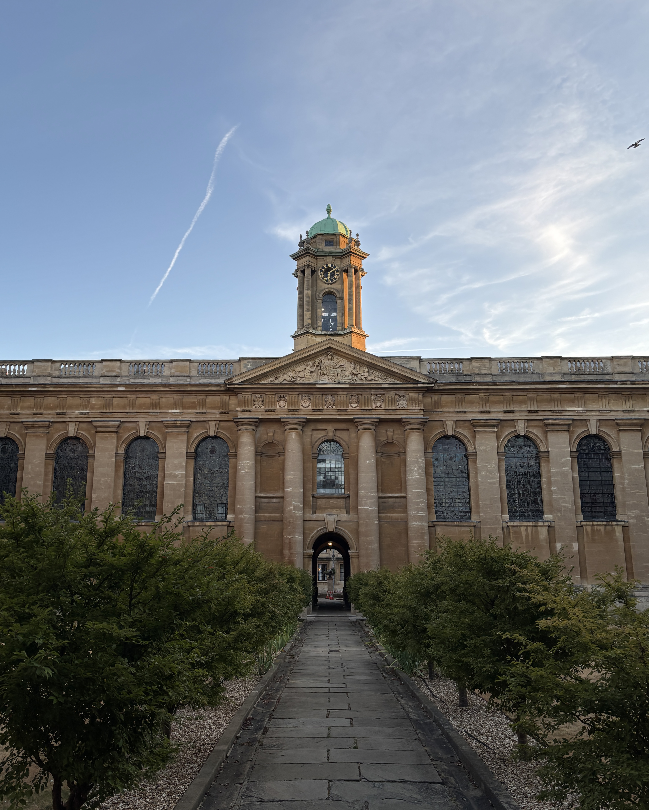

<!-- TRAVEL: replace the image, location, and short reflection with your own. -->

{.travel-photo fig-alt="Water flowing over Niagara Falls, surrounded by green trees."}

## Quenn's College, Oxford

[Study Abroad]{.project-label}

Through the Loyola Marymount University Study Abroad program, I spent a month studying at the Queen's College, a college of the University of Oxford.

I'm interested in the small details that make a place feel different: how people move through it, where they gather, and what they stop to notice.

## What I want to remember

- The details that a photograph doesn't capture.
- A question about the place or the people who live there.
- Something I would notice differently on a return visit.

<!-- Add another place by copying the image and heading pattern above. -->

